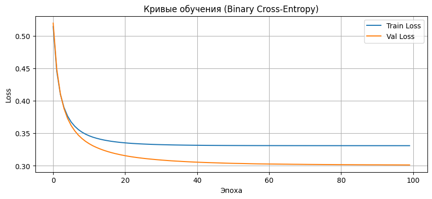
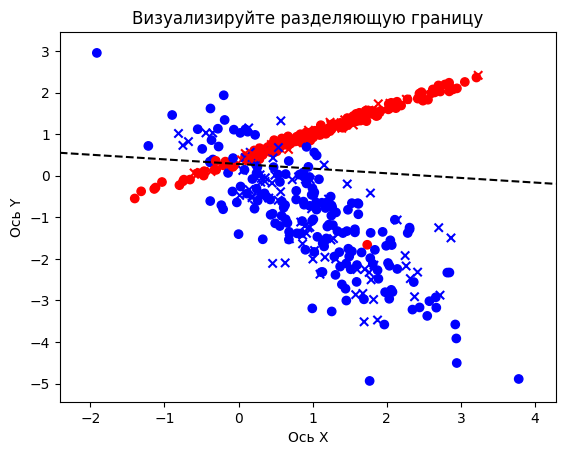
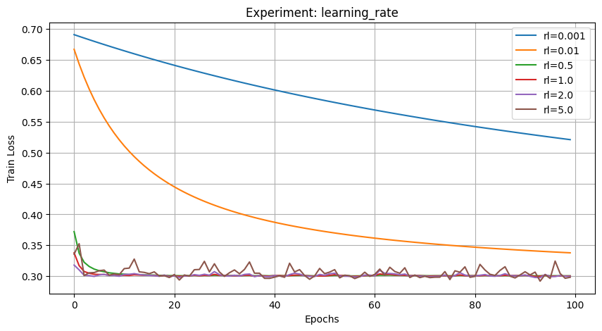
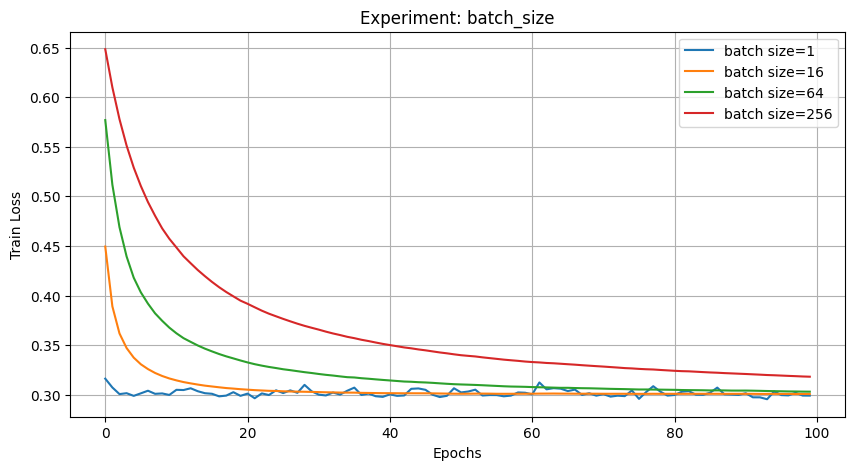
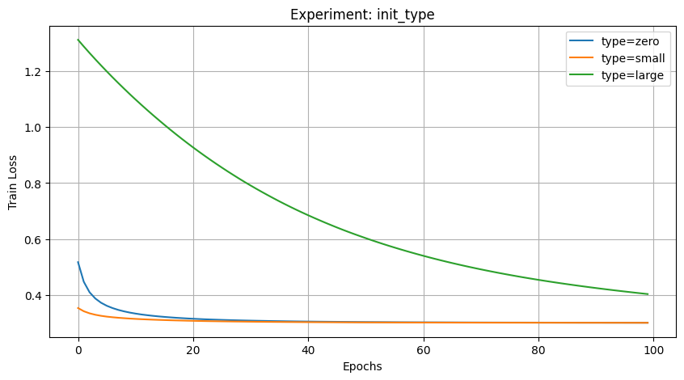
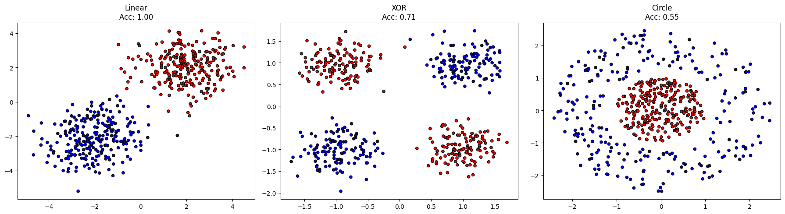
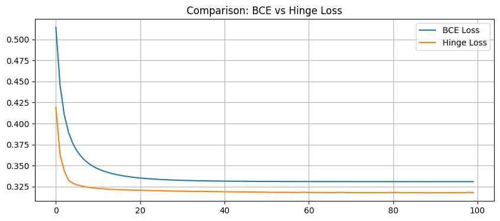
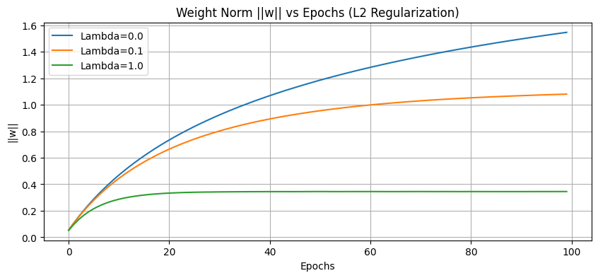
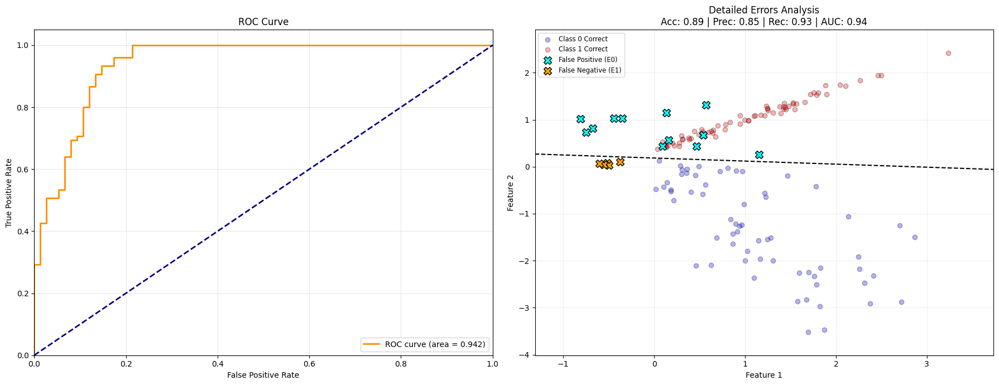
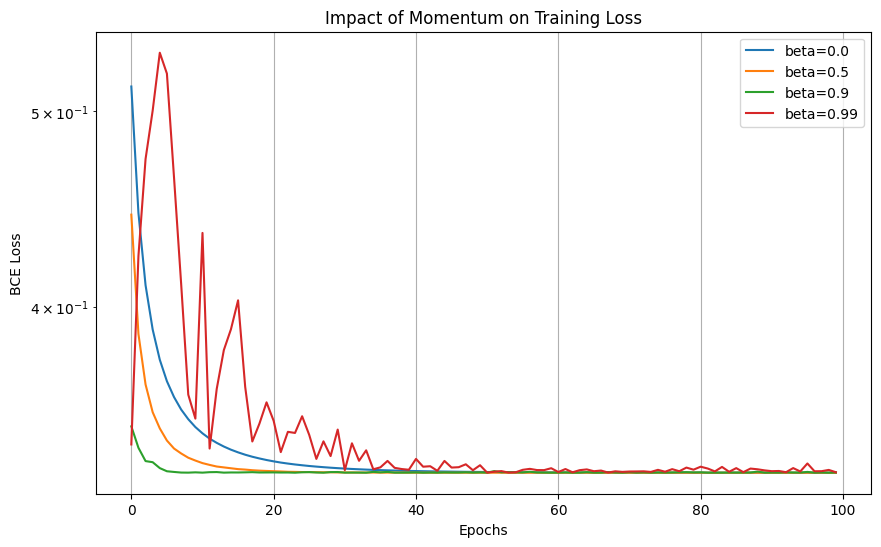

# Лабораторная работа №2
## Однослойный перцептрон: реализация, обучение и анализ

**Выполнил:** Шилин Василий, Б25-507

## Цель работы

Цель работы - реализовать однослойный перцептрон для бинарной классификации без
использования готовых моделей машинного обучения, исследовать процесс его
обучения и определить границы применимости линейного классификатора.

В работе выполнены:

- генерация двумерного набора данных и разбиение на train/test;
- реализация сигмоиды, прямого прохода, binary cross-entropy и mini-batch SGD;
- построение кривых обучения и разделяющей границы;
- эксперименты со скоростью обучения, размером батча и инициализацией весов;
- дополнительные задания: собственные датасеты, Hinge loss, L2-регуляризация,
  метрики, ROC-кривая, momentum и кросс-валидация.

## Структура проекта

```text
lab2_perceptron_project/
|-- dataset.py          # базовый датасет и собственные генераторы данных
|-- perceptron.py       # Perceptron, Hinge/L2 и Momentum-модификации
|-- metrics.py          # precision, recall, F1 и ROC-AUC
|-- visualization.py    # построение графиков и границ решения
|-- main.py             # обязательная часть: базовое обучение
|-- experiments.py      # все эксперименты и дополнительные задания
|-- figures/            # графики
|-- requirements.txt
|-- README.md
`-- линал_2_лаба.ipynb  
```

## Постановка задачи

Рассматривается бинарная классификация объектов с двумя числовыми признаками.
Перцептрон вычисляет линейную комбинацию признаков

```text
z = w^T x + b
```

и преобразует её в вероятность класса `1` сигмоидной функцией:

```text
sigmoid(z) = 1 / (1 + exp(-z)).
```

Класс выбирается порогом `0.5`. Следовательно, разделяющая граница модели имеет
вид `w^T x + b = 0` и является прямой линией.

Для обучения используется бинарная кросс-энтропия:

```text
BCE = -mean(y * log(y_hat) + (1 - y) * log(1 - y_hat)).
```

Градиенты вычисляются по мини-батчам:

```text
dw = X_batch^T (y_hat - y) / m
db = sum(y_hat - y) / m
w <- w - lr * dw
b <- b - lr * db
```

## Подготовка данных

В ноутбуке сгенерирован набор данных функцией `make_classification`:

| Параметр | Значение |
|---|---:|
| Число объектов | 500 |
| Число признаков | 2 |
| Информативные признаки | 2 |
| Избыточные признаки | 0 |
| Кластеров на класс | 1 |
| `random_state` | 42 |

Разбиение выполняется в отношении `70% / 30%` со стратификацией по целевому
классу и `random_state=42`. Модуль `dataset.py` дополнительно содержит
правильный режим стандартизации по ТЗ: scaler обучается только на `X_train`, а
к `X_test` применяются уже найденные параметры.

## Базовая модель

Основной запуск использует параметры из задания:

| Параметр | Значение |
|---|---:|
| Скорость обучения `lr` | 0.1 |
| Число эпох | 100 |
| Размер батча | 32 |
| Инициализация весов | малые случайные значения |
| Смещение | 0 |

Итоговые значения из ноутбука:

| Метрика | Значение |
|---|---:|
| Train loss, эпоха 100 | 0.3308 |
| Validation loss, эпоха 100 | 0.3011 |
| Accuracy на train | 0.8657 |
| Accuracy на test | 0.8867 |

Кривые loss монотонно выходят на плато: основное уменьшение ошибки происходит
в первые десятки эпох, после чего модель почти перестаёт улучшаться.



На следующем графике показаны точки обучающей и тестовой выборок и найденная
линейная граница решения. Для данного набора данных одной прямой достаточно,
чтобы получить тестовую точность около `88.7%`.



## Эксперимент 1. Скорость обучения

В ТЗ предлагаются значения `0.001`, `0.01`, `0.5`, `1.0`;
исследование расширено значениями `2.0` и `5.0`.

| Learning rate | Test accuracy | Final train loss | Final val loss |
|---:|---:|---:|---:|
| 0.001 | 0.893333 | 0.515919 | 0.521047 |
| 0.01 | 0.880000 | 0.348744 | 0.337745 |
| 0.5 | 0.886667 | 0.330826 | 0.300468 |
| 1.0 | 0.886667 | 0.330882 | 0.300182 |
| 2.0 | 0.886667 | 0.331112 | 0.299463 |
| 5.0 | 0.886667 | 0.334968 | 0.298144 |



При `lr=0.001` модель обучается слишком медленно: спустя 100 эпох loss остаётся
заметно выше. Значения от `0.5` до `2.0` быстро достигают области минимума.
При `lr=5.0` итоговая ошибка остаётся небольшой, но кривая сильнее колеблется,
что соответствует перескакиванию через минимум при слишком большом шаге.

## Эксперимент 2. Размер батча

| Batch size | Test accuracy | Final train loss | Final val loss |
|---:|---:|---:|---:|
| 1 | 0.886667 | 0.331549 | 0.299068 |
| 16 | 0.886667 | 0.330802 | 0.300697 |
| 64 | 0.886667 | 0.331054 | 0.303044 |
| 256 | 0.886667 | 0.336588 | 0.318138 |



`batch_size=1` соответствует SGD и даёт частые обновления весов. Средние
батчи `16` и `64` обеспечивают близкое качество при более спокойной динамике.
Большой батч `256` выполняет мало обновлений за эпоху, поэтому за заданные
100 эпох остаётся с большим validation loss.

## Эксперимент 3. Инициализация весов

| Инициализация | Test accuracy | Final train loss | Final val loss |
|---|---:|---:|---:|
| Нулевая (`zero`) | 0.886667 | 0.330802 | 0.301137 |
| Малая случайная (`small`) | 0.886667 | 0.330796 | 0.300973 |
| Большая случайная (`large`) | 0.866667 | 0.619155 | 0.403575 |



Для единственного нейрона нулевая инициализация допустима: проблемы симметрии
нескольких одинаковых нейронов здесь нет. Малые случайные веса показывают
стабильную сходимость. Большие веса ухудшают результат, поскольку сигмоида
попадает в область насыщения и градиенты становятся малы.

## Дополнительное задание 1. Собственные датасеты

В `dataset.py` реализованы три генератора:

| Генератор | Описание |
|---|---|
| `generate_linear` | два гауссовых облака с заданными центрами и ковариацией |
| `generate_xor` | четыре облака в углах квадрата с чередованием классов |
| `generate_circle` | точки внутри и снаружи окружности |

В модульной версии у каждого генератора есть параметр `noise`, который меняет
метку объекта с заданной вероятностью и реализует требование ТЗ о
контролируемом шуме.

| Тип данных | Accuracy на визуализируемой выборке | Вывод |
|---|---:|---|
| Linear | 1.00 | классы полностью разделяются прямой |
| XOR | 0.71 | одной прямой недостаточно для структуры XOR |
| Circle | 0.55 | линейная граница не выделяет внутреннюю область |



Результат демонстрирует главное ограничение однослойного перцептрона: он
успешен на линейно разделимых данных, но не способен выразить нелинейные
границы типа XOR или окружности без преобразования признаков.

## Дополнительное задание 2. Hinge loss и L2

Для меток `y in {-1, +1}` реализована функция Hinge loss:

```text
Hinge = mean(max(0, 1 - y * z)).
```

Она создаёт постоянный градиент для объектов, нарушающих отступ, и потому на
начальной стадии обучения может уменьшаться быстрее BCE. Binary
cross-entropy изменяется более плавно.



Для BCE также добавлен штраф:

```text
L = BCE + lambda / 2 * ||w||^2.
```

| Lambda | Test accuracy | Финальная норма весов |
|---:|---:|---:|
| 0.0 | 0.880000 | 1.545945 |
| 0.1 | 0.880000 | 1.079761 |
| 1.0 | 0.886667 | 0.345136 |



При увеличении `lambda` от `0.0` до `1.0` норма весов уменьшается примерно в
`4.5` раза, а accuracy не ухудшается. В этом эксперименте регуляризация
уменьшает сложность модели без потери качества на тестовой выборке.

## Дополнительное задание 3. Метрики и анализ ошибок

Для финальной модели рассчитаны `precision`, `recall`, `F1` и `ROC-AUC`.

| Метрика | Значение |
|---|---:|
| Accuracy | 0.89 |
| Precision | 0.85 |
| Recall | 0.93 |
| F1-score | примерно 0.89 |
| ROC-AUC | 0.94 (`0.942` в легенде ROC) |



Высокий recall означает, что модель находит почти все объекты положительного
класса. Ошибочные точки сосредоточены вблизи разделяющей прямой и в области
перекрытия классов: именно там линейной модели сложнее принять уверенное
решение.

## Дополнительное задание 4. Momentum

Реализовано обновление с импульсом:

```text
v_w <- beta * v_w - lr * dw
v_b <- beta * v_b - lr * db
w <- w + v_w
b <- b + v_b
```

В ноутбуке сравниваются `beta = 0.0`, `0.5`, `0.9`, `0.99`.



`beta=0.9` быстрее выходит на малое значение loss. При `beta=0.99` в начале
обучения наблюдаются заметные скачки: слишком большой накопленный импульс
делает оптимизацию нестабильной. Обычный SGD (`beta=0`) сходится устойчиво, но
медленнее.

## Дополнительное задание 5. Кросс-валидация

Для подбора `learning rate` и `batch_size` выполнена 5-кратная
кросс-валидация по обучающей выборке.

| Learning rate | Batch size | Mean accuracy | Std accuracy |
|---:|---:|---:|---:|
| 0.01 | 16 | 0.868571 | 0.044630 |
| 0.01 | 32 | 0.854286 | 0.052216 |
| 0.01 | 64 | 0.854286 | 0.052216 |
| 0.10 | 16 | 0.865714 | 0.032071 |
| 0.10 | 32 | 0.865714 | 0.032071 |
| 0.10 | 64 | 0.860000 | 0.041796 |
| 0.50 | 16 | 0.868571 | 0.027701 |
| 0.50 | 32 | 0.868571 | 0.027701 |
| 0.50 | 64 | 0.862857 | 0.029416 |

Метод `idxmax()` в ноутбуке выбирает первую комбинацию с максимальным средним
результатом: `lr=0.01`, `batch_size=16`. После обучения финальной модели с
этими параметрами тестовая точность составила `0.8867`.

## Общий вывод

В ходе работы реализован однослойный перцептрон с нуля на NumPy и проведено
исследование его обучения. На базовом почти линейно разделимом наборе модель
достигает тестовой точности `0.8867`. Скорость обучения сильнее всего влияет
на быстроту выхода к минимуму; размер батча определяет частоту обновлений и
характер кривой loss; слишком крупная инициализация ухудшает обучение из-за
насыщения сигмоиды.

Дополнительные эксперименты подтвердили теоретические ограничения линейной
модели: на двух гауссовых облаках достигается точность `1.00`, но для XOR и
окружности одной прямой недостаточно. L2-регуляризация уменьшила норму весов
без потери точности, momentum ускорил сходимость при умеренном коэффициенте,
а ROC-AUC около `0.94` показал хорошее ранжирование объектов базовой задачи.

## Запуск

Установка зависимостей:

```bash
pip install -r requirements.txt
```

Базовая часть:

```bash
python main.py
```

Все эксперименты и дополнительные задания:

```bash
python experiments.py
```
